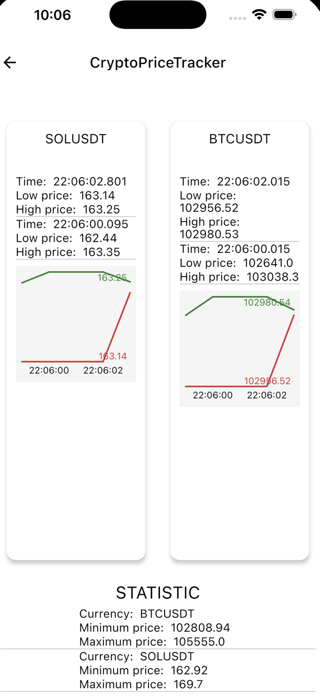

# Crypto Price Tracker Project

**CryptoPriceTracker** is a **Kotlin Multiplatform** project demonstrating the implementation of **runtime
permission handling** and real-time **cryptocurrency price tracking from the Binance** platform. It is
intended for a **UChicago MPCS Capstone Project**.
The projects use the following features:

- **Ktor-client**
- **Model-view-ViewModel**
- **Room**

### Real-time Crypto Price Tracking Sample

(To be updated)
| Android                                                                               | iOS                                                                           |
|---------------------------------------------------------------------------------------|-------------------------------------------------------------------------------|
|  |  |

This project connect to crypto exchange API to query and display live crypto prices.
It uses `Ktor-client` websockets to connect to Binance API for real-time cryptocurrency price tracking.

- The data is stored locally using the `Room` framework.
- It is saved in the database in a **circular buffer style** with a defined capacity.
- Additionally, a **database view** was created to display statistics for individual cryptocurrencies.
- To be added a graphic visualization for crypto prices

In addition, the app also asks users for permission to share with phone contacts, as well as voice and recording permissions.
This is used as an eventual integration with the crypto price tracker to be able to share the application with contacts, as well as receiving voice notifications.
It's currectly only a placeholder to demonstrate the usage.

---

